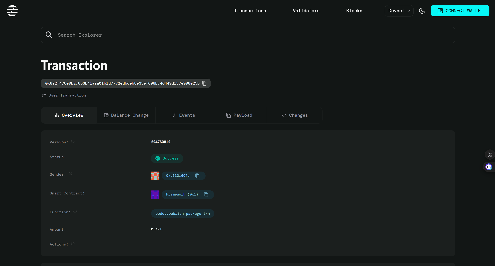

# Voting System for Group Decision

## Project Description

The Voting System for Group Decision is a decentralized smart contract built on the Aptos blockchain that enables transparent and secure group decision-making processes. This smart contract allows any user to create voting polls with simple yes/no questions and enables community members to cast their votes in a trustless manner. The system ensures vote integrity by preventing double voting and maintaining a transparent record of all votes cast.

The contract implements a straightforward voting mechanism where poll creators can propose questions or decisions, and participants can vote either "yes" or "no" on the proposal. All voting data is stored immutably on the blockchain, ensuring transparency and preventing tampering with results.

## Project Vision

Our vision is to democratize decision-making processes by providing a decentralized, transparent, and accessible voting platform. We aim to eliminate the need for centralized authorities in group decisions, reduce voting fraud, and increase participation in democratic processes. By leveraging blockchain technology, we envision a future where every vote is counted, verified, and permanently recorded, fostering trust and transparency in collective decision-making.

The platform strives to bridge the gap between traditional voting systems and modern blockchain technology, making it easier for communities, organizations, and groups of any size to conduct fair and transparent polls.

## Key Features

### ✅ **Simple Poll Creation**
- Any user can create a voting poll with a custom proposal/question
- Easy-to-use interface for setting up yes/no voting scenarios
- Decentralized poll ownership and management

### ✅ **Secure Voting Mechanism**
- One vote per address policy to prevent vote manipulation
- Cryptographic security through blockchain technology
- Immutable vote recording that cannot be altered after casting

### ✅ **Real-time Vote Tracking**
- Live counting of yes and no votes
- Total voter participation tracking
- Complete transparency of voting results

### ✅ **Anti-Double Voting Protection**
- Smart contract-level prevention of multiple votes from same address
- Voter record system to track participation status
- Error handling for duplicate vote attempts

### ✅ **Transparent Results**
- Public visibility of all vote counts
- Open access to voting statistics
- Verifiable voting history on the blockchain

### ✅ **Decentralized Architecture**
- No central authority controlling the voting process
- Peer-to-peer verification through blockchain consensus
- Censorship-resistant voting platform

## Future Scope

### 🚀 **Enhanced Voting Options**
- Multiple choice voting (beyond yes/no)
- Weighted voting based on token holdings
- Time-bound voting with automatic poll closure
- Anonymous voting mechanisms

### 🚀 **Advanced Poll Management**
- Poll categories and tagging system
- Voting delegation and proxy voting
- Minimum participation threshold requirements
- Poll result analytics and visualization

### 🚀 **Integration & Scalability**
- Cross-chain voting compatibility
- Integration with governance tokens
- Mobile application development
- API endpoints for third-party integrations

### 🚀 **Community Features**
- Discussion forums for each poll
- Voting history and user profiles
- Reputation system for active participants
- Notification system for new polls and results

### 🚀 **Security Enhancements**
- Multi-signature poll creation
- Vote encryption for privacy
- Audit trail and compliance features
- Integration with identity verification systems

---

## Contract Details
0x8a2f476e0b2c8b3b41aaa01b1d7772edbdeb8e35ef608bc46449d137e908e25b

